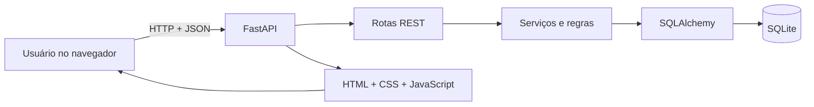
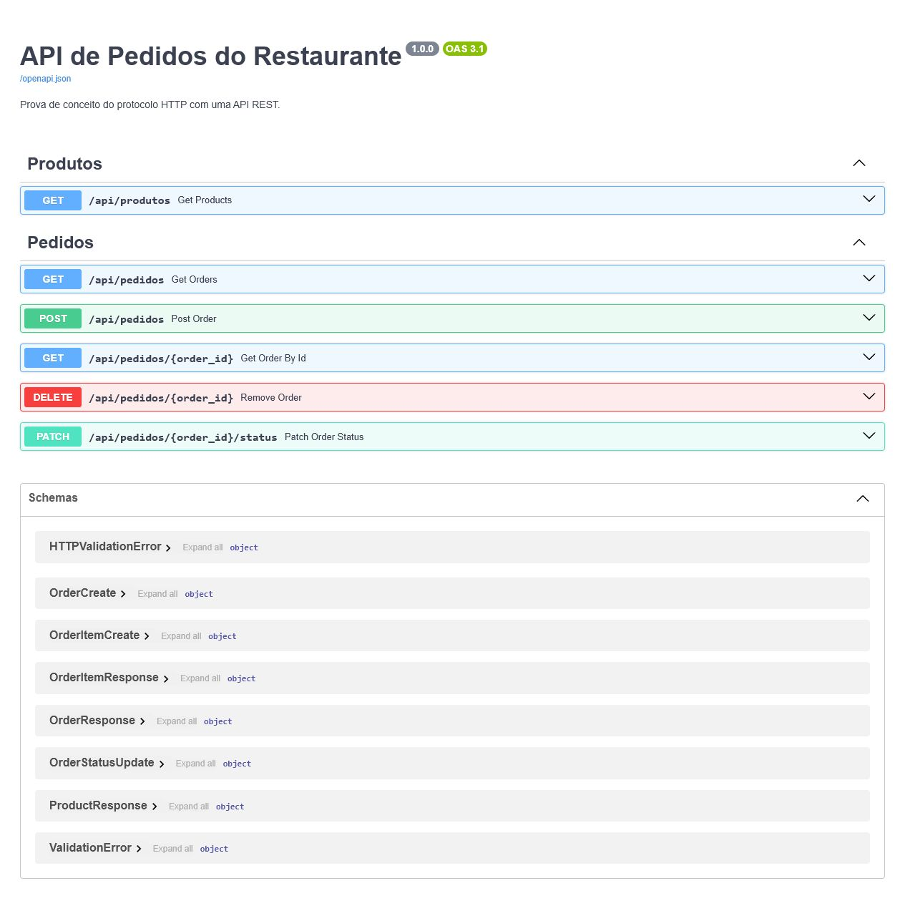

# Mesa Rápida — Sistema de Pedidos com HTTP

Prova de conceito de uma aplicação distribuída baseada em **HTTP**, composta por uma API REST, uma interface web e persistência em SQLite.

| Identificação | Informação |
| --- | --- |
| Aluno | Bernardo Gomes Dorneles |
| Matrícula | 2410103114 |
| Professor | Silvio Ereno Quincozes |
| Disciplina | Redes |
| Protocolo escolhido | HTTP |

## Cenário

Um restaurante precisa registrar pedidos, consultar o cardápio e acompanhar o fluxo da cozinha. Atendentes ou clientes acessam a aplicação por um navegador, enquanto a cozinha atualiza os pedidos entre os estados:

```text
recebido → preparando → pronto → entregue
```

O sistema permite:

- consultar produtos;
- montar e enviar um pedido;
- calcular o total no servidor;
- listar e consultar pedidos;
- avançar o estado de um pedido;
- cancelar pedidos;
- explorar e testar a API pelo Swagger.

## Por que HTTP?

HTTP é adequado porque o cenário é orientado a ações iniciadas pelo usuário e ao modelo **requisição–resposta**. Os clientes são navegadores, os recursos podem ser identificados por URLs e as operações correspondem naturalmente a métodos REST.

Principais motivos:

- suporte nativo em navegadores e ferramentas;
- interoperabilidade entre diferentes plataformas;
- métodos com semântica conhecida (`GET`, `POST`, `PATCH` e `DELETE`);
- códigos de estado que comunicam o resultado da operação;
- JSON como representação simples e amplamente suportada;
- documentação automática com OpenAPI;
- volume moderado de requisições, sem telemetria contínua;
- ausência de dispositivos com restrição severa de energia.

HTTP não foi escolhido por ser universalmente superior. Ele se ajusta melhor aos requisitos específicos deste cenário.

## Requisitos de comunicação

| Requisito | Característica do cenário |
| --- | --- |
| Frequência | Sob demanda: ações de pessoas e atualizações de estado |
| Clientes | Navegadores de atendentes, clientes e cozinha |
| Latência | Respostas interativas, normalmente abaixo de poucos segundos |
| Banda | Baixo volume; mensagens JSON pequenas |
| Energia | Não há sensores alimentados por bateria |
| Confiabilidade | Cada resposta confirma sucesso ou informa erro |
| Escalabilidade | API sem estado de sessão; banco pode ser substituído no futuro |
| Segurança | Projeto local; produção exigiria HTTPS, autenticação e autorização |

## Comparação dos protocolos

| Protocolo | Modelo | Vantagens | Limitação neste cenário |
| --- | --- | --- | --- |
| **HTTP** | Requisição–resposta | Navegadores, REST, cache, códigos de estado e amplo suporte | Mais overhead que protocolos binários leves |
| **MQTT** | Publicação–assinatura | Excelente para telemetria, muitos dispositivos e conexões instáveis | Exige broker e não representa CRUD de forma tão direta |
| **CoAP** | Requisição–resposta sobre UDP | Leve para dispositivos restritos e redes de baixa potência | Menor suporte direto em navegadores e infraestrutura web |
| **AMQP** | Filas e roteamento de mensagens | Entrega robusta, confirmação e integração empresarial assíncrona | Broker e configuração adicionam complexidade desnecessária |
| **MCP** | Modelo–cliente–servidor de ferramentas | Padroniza a integração de modelos de IA com recursos externos | Resolve integração de IA, não pedidos comuns entre navegador e API |

### Quando outro protocolo seria melhor?

- **MQTT:** sensores publicando temperatura continuamente.
- **CoAP:** dispositivos embarcados com memória, energia e banda limitadas.
- **AMQP:** pedidos distribuídos entre múltiplos sistemas, com filas duráveis e retentativas.
- **MCP:** um assistente de IA operando ferramentas do restaurante.

## Arquitetura



Mais detalhes estão em [docs/arquitetura.md](docs/arquitetura.md).

## Tecnologias

- Python 3.11 ou superior;
- FastAPI;
- Uvicorn;
- SQLAlchemy;
- SQLite;
- Pydantic;
- pytest e HTTPX;
- HTML, CSS e JavaScript sem framework.

## Estrutura

```text
app/
├── database.py          # Conexão e sessões SQLite
├── main.py              # Aplicação FastAPI e frontend
├── models.py            # Entidades SQLAlchemy
├── schemas.py           # Contratos de entrada e saída
├── services.py          # Regras de negócio
├── routers/
│   ├── orders.py        # Rotas de pedidos
│   └── products.py      # Rotas de produtos
└── static/
    ├── index.html       # Interface
    ├── styles.css       # Design responsivo
    └── app.js           # Consumo da API
tests/                   # Testes automatizados
docs/                    # Arquitetura, especificação e evidências
```

## Instalação

### Windows PowerShell

```powershell
git clone https://github.com/bNDorneles/sistema-pedidos-http.git
cd sistema-pedidos-http
python -m venv .venv
.\.venv\Scripts\Activate.ps1
python -m pip install -r requirements.txt
```

Se o PowerShell bloquear a ativação, é possível usar diretamente:

```powershell
.\.venv\Scripts\python.exe -m pip install -r requirements.txt
.\.venv\Scripts\python.exe -m uvicorn app.main:app --reload
```

### Linux ou macOS

```bash
git clone https://github.com/bNDorneles/sistema-pedidos-http.git
cd sistema-pedidos-http
python3 -m venv .venv
source .venv/bin/activate
python -m pip install -r requirements.txt
```

## Execução

```bash
python -m uvicorn app.main:app --reload
```

Acesse:

- interface: [http://127.0.0.1:8000](http://127.0.0.1:8000);
- Swagger: [http://127.0.0.1:8000/docs](http://127.0.0.1:8000/docs);
- OpenAPI JSON: [http://127.0.0.1:8000/openapi.json](http://127.0.0.1:8000/openapi.json).

O arquivo `restaurante.db` e o cardápio inicial são criados automaticamente.

## Endpoints

| Método | Rota | Função | Resposta |
| --- | --- | --- | --- |
| `GET` | `/api/produtos` | Listar cardápio | `200 OK` |
| `POST` | `/api/pedidos` | Criar pedido | `201 Created` |
| `GET` | `/api/pedidos` | Listar pedidos | `200 OK` |
| `GET` | `/api/pedidos/{id}` | Consultar pedido | `200 OK` |
| `PATCH` | `/api/pedidos/{id}/status` | Avançar estado | `200 OK` |
| `DELETE` | `/api/pedidos/{id}` | Cancelar pedido | `204 No Content` |

### Exemplo: criar um pedido

```bash
curl -X POST http://127.0.0.1:8000/api/pedidos \
  -H "Content-Type: application/json" \
  -d '{"itens":[{"produto_id":1,"quantidade":2},{"produto_id":5,"quantidade":1}]}'
```

Resposta resumida:

```json
{
  "id": 1,
  "status": "recebido",
  "total": "65.30",
  "criado_em": "2026-06-26T18:30:00",
  "itens": [
    {
      "produto_id": 1,
      "nome_produto": "Xis Gaúcho",
      "quantidade": 2,
      "preco_unitario": "28.90",
      "subtotal": "57.80"
    }
  ]
}
```

### Exemplo: avançar estado

```bash
curl -X PATCH http://127.0.0.1:8000/api/pedidos/1/status \
  -H "Content-Type: application/json" \
  -d '{"status":"preparando"}'
```

O servidor aceita somente a próxima etapa. Tentar passar diretamente de `recebido` para `pronto` produz `400 Bad Request`.

## Códigos HTTP demonstrados

| Código | Uso |
| --- | --- |
| `200 OK` | Consulta ou atualização concluída |
| `201 Created` | Pedido criado |
| `204 No Content` | Pedido removido |
| `400 Bad Request` | Transição de estado inválida |
| `404 Not Found` | Produto ou pedido inexistente |
| `422 Unprocessable Entity` | JSON ou valores inválidos |

## Testes

```bash
python -m pytest -v
```

Casos cobertos:

- criação e consulta das tabelas;
- seed e listagem do cardápio;
- serialização de preços;
- criação de pedido e cálculo no servidor;
- consolidação de produtos repetidos;
- pedido vazio, quantidade inválida e produto inexistente;
- listagem e consulta;
- fluxo completo dos estados;
- transições inválidas;
- cancelamento;
- entrega da página e dos arquivos estáticos.

Resultado da entrega:

```text
19 passed
```

## Evidências

### Painel web


### Swagger



## Resultados

A prova de conceito demonstrou:

- comunicação real entre navegador e servidor via HTTP;
- uso coerente dos métodos e códigos de estado;
- representação dos recursos em JSON;
- validação de dados no servidor;
- persistência após reiniciar a aplicação;
- separação entre interface, protocolo, regras e banco;
- documentação automática e testes reproduzíveis.

## Limitações e melhorias futuras

O projeto é didático e roda localmente. Uma versão de produção deveria acrescentar:

- HTTPS;
- autenticação e perfis de acesso;
- migrações de banco;
- paginação e filtros;
- proteção contra abuso e limites de requisição;
- banco servidor, como PostgreSQL;
- implantação em nuvem;
- eventos em tempo real, possivelmente com WebSocket ou mensageria.

## Licença

Distribuído sob a licença MIT. Consulte [LICENSE](LICENSE).
