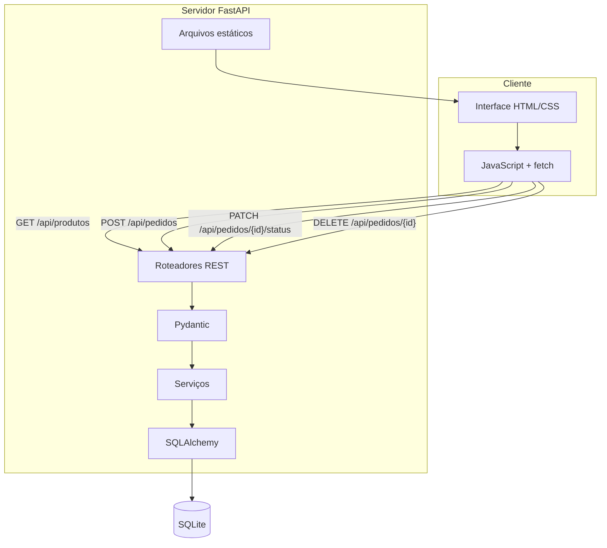
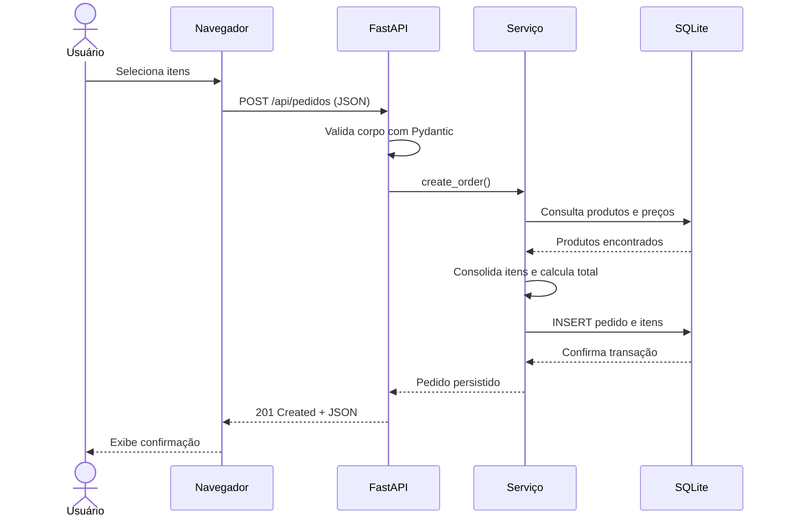
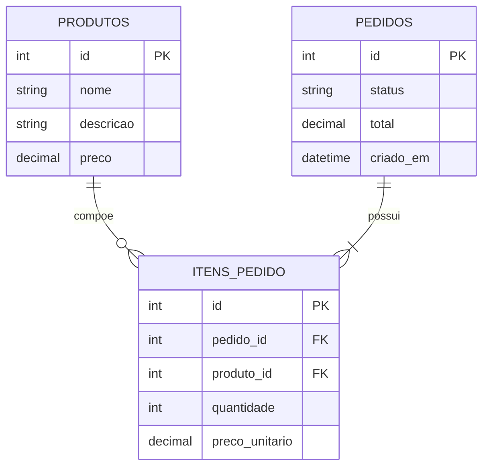

# Arquitetura e fluxo HTTP

## Componentes

## Responsabilidades

| Unidade | Responsabilidade |
| --- | --- |
| `database.py` | Configurar engine, base e sessões |
| `models.py` | Representar tabelas e relacionamentos |
| `schemas.py` | Validar JSON e definir respostas |
| `services.py` | Aplicar regras independentemente do transporte |
| `routers/` | Associar regras a métodos, URLs e códigos HTTP |
| `static/` | Apresentar e consumir os recursos da API |

## Sequência de criação

## Modelo de dados

O preço unitário é copiado para o item no momento da criação. Assim, o histórico do pedido não muda caso o preço do cardápio seja alterado posteriormente.

## Decisões

- O total é calculado no servidor, nunca aceito do cliente.
- Todos os produtos são validados antes do `commit`.
- Itens repetidos são consolidados.
- Os estados seguem uma máquina simples e não podem pular etapas.
- A exclusão usa `204 No Content`.
- O SQLite reduz dependências externas, sem esconder o uso real de um banco relacional.
